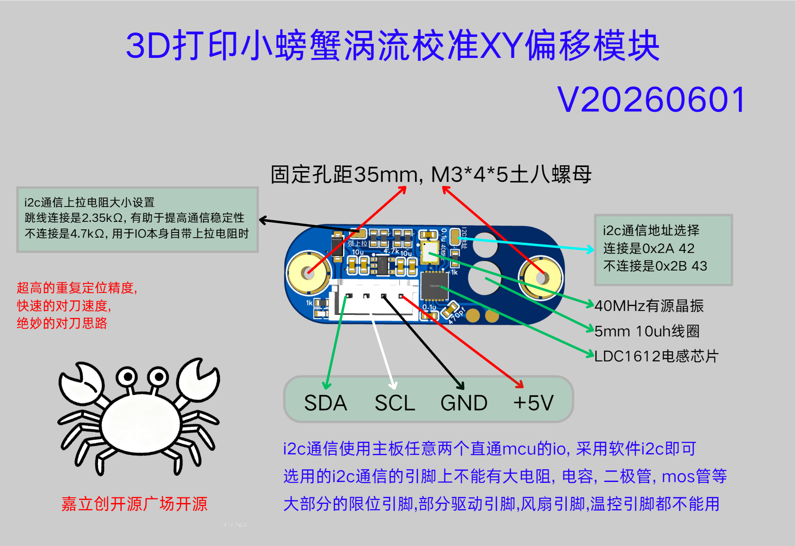
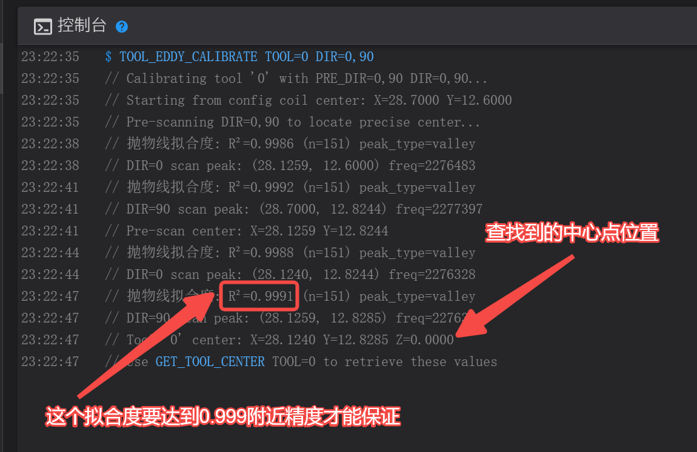
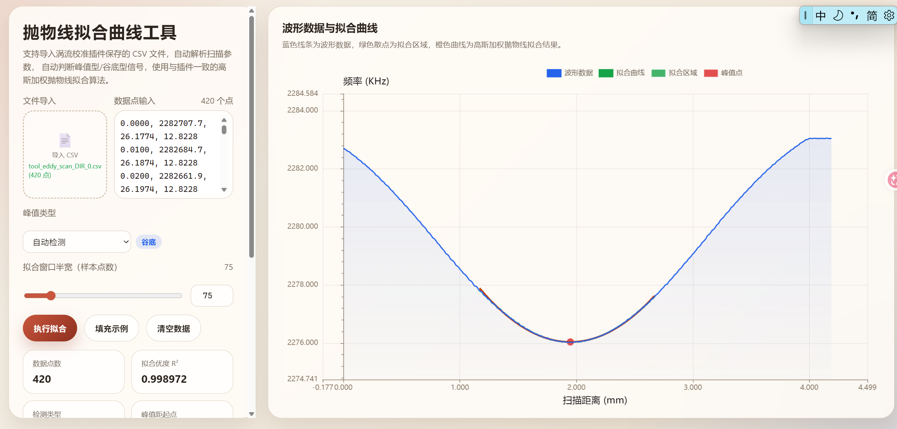

# 3D打印小螃蟹涡流XY偏移校准

基于涡流传感器（LDC1612）的多热端 XY 偏移自动校准 Klipper 插件。

**原理**：在已知线圈位置的基础上，沿多个方向扫描，检测频率极值位置，通过最小二乘法（LSQ）或配对平均法重建工具中心坐标，实现微米级精度定位。

> 嘉立创开源广场开源：[https://oshwhub.com/cxg01/project_lbabffjk](https://oshwhub.com/cxg01/project_lbabffjk)
>
> 换热端项目地址：[https://github.com/cx330-TXY/Simple-Multi-Hotend](https://github.com/cx330-TXY/Simple-Multi-Hotend)



---

## 功能特点

- **自动校准**：沿多个方向扫描涡流信号，自动检测频率峰值/谷值，通过抛物线拟合实现亚采样精度定位
- **预扫描机制**：先粗扫定位精确中心，再以精确中心为基准进行精细扫描，提高校准可靠性
- **配对消除**：支持正反方向配对扫描，消除运动滞后引起的系统误差
- **多次重复**：支持多次测量取平均，并给出标准差统计
- **自动峰型检测**：自动识别信号是峰值形（大线圈）还是谷值形（小线圈），无需手动配置
- **传感器测试**：内置 LDC1612 传感器诊断命令，快速排查接线与信号质量问题
- **数据导出**：可选保存扫描数据为 CSV，配合自带可视化工具分析

---

## 安装

1. 下载 `tool_eddy_calibration.py` 文件
2. 上传到 Klipper 插件目录：`~/klipper/klippy/extras/tool_eddy_calibration.py`
3. 重启 Klipper 固件
---

## 配置

在 `printer.cfg` 中添加以下配置段：

```ini
[tool_eddy_calibration my_calibrator]
sensor_type: ldc1612
frequency: 40000000
reg_drive_current: 22

# 线圈相对于喷嘴的位置（mm）
coil_x: 23.0
coil_y: 15.0
coil_z: 0.0

# 线圈内径（mm），影响抛物线拟合窗口大小
coil_inner_diameter: 2.0

# 扫描参数
scan_height: 0.5        # 扫描时线圈到标定板的距离（mm）
scan_speed: 4.0         # 扫描移动速度（mm/s）
scan_length: 6.0       # 每次扫描的直线长度（mm）
scan_safe_z: 2.0        # 扫描安全抬升高度（mm）
travel_speed_xy: 100.0   # XY 移动速度（mm/s）
travel_speed_z: 10.0    # Z 移动速度（mm/s）

# 是否保存扫描数据到 CSV（可选，默认 false）
save_data: False
```

### 配置参数说明

| 参数 | 默认值 | 范围 | 说明 |
|------|--------|------|------|
| `sensor_type` | — | `ldc1612` | 涡流传感器类型 |
| `coil_x` | — | — | 线圈中心 X 坐标（相对于喷嘴） |
| `coil_y` | — | — | 线圈中心 Y 坐标（相对于喷嘴） |
| `coil_z` | — | — | 线圈 Z 坐标（相对于喷嘴），用于计算安全高度 |
| `coil_inner_diameter` | 2.0 | 1.5–30.0 | 线圈内径，影响抛物线拟合窗口 |
| `scan_height` | 0.5 | -20.0–50.0 | 扫描高度（相对 coil_z） |
| `scan_speed` | 5.0 | 0.5–20.0 | 扫描速度 |
| `travel_speed_xy` | 100.0 | 5.0–300.0 | XY 空行移动速度 |
| `travel_speed_z` | 10.0 | 1.0–50.0 | Z 轴移动速度 |
| `scan_length` | 10.0 | 2.0–20.0 | 单次扫描长度 |
| `scan_safe_z` | 2.0 | 0.5–10.0 | 安全抬升距离 |
| `save_data` | False | — | 是否保存扫描数据到 CSV |

---

## 插件命令

### `TOOL_EDDY_CALIBRATE`

校准指定工具的中心位置。

```
TOOL_EDDY_CALIBRATE TOOL=<名称> [DIR=<角度列表>] [PRE_DIR=<角度列表>] [SCAN_HEIGHT_OFFSET=<偏移>] [REPEATS=<次数>] [PAIR_CANCEL=<0|1>] [CENTER_XY=<X,Y>]
```

| 参数 | 必填 | 默认值 | 说明 |
|------|------|--------|------|
| `TOOL` | ✅ | — | 工具名称标识（如 `0`、`1`） |
| `DIR` | ❌ | `45,135` | 精确扫描方向角度（逗号分隔，0=X+, 90=Y+） |
| `PRE_DIR` | ❌ | 等于 DIR | 预扫描方向角度（逗号分隔） |
| `SCAN_HEIGHT_OFFSET` | ❌ | `0.0` | 扫描高度偏移（正值远离线圈，负值靠近线圈） |
| `REPEATS` | ❌ | `1` | 重复测量次数（1–10），取平均值 |
| `PAIR_CANCEL` | ❌ | `0` | 是否启用配对消除（自动添加反方向，消除滞后误差） |
| `CENTER_XY` | ❌ | 配置值 | 覆盖预扫描起始中心点（格式：`X,Y`） |

**示例：**

```gcode
; 基本校准（默认 45°/135° 方向）
TOOL_EDDY_CALIBRATE TOOL=0

; 四方向扫描 + 配对消除 + 3次重复
TOOL_EDDY_CALIBRATE TOOL=0 DIR=0,45,90,135 PAIR_CANCEL=1 REPEATS=3

; 指定预扫描方向和自定义中心点
TOOL_EDDY_CALIBRATE TOOL=1 PRE_DIR=0,90 DIR=45,135 CENTER_XY=23,-15
```

### `GET_TOOL_CENTER`

查询上次校准的工具中心位置。

```
GET_TOOL_CENTER TOOL=<名称>
```

**示例：**

```gcode
GET_TOOL_CENTER TOOL=0
; 输出: Tool '0' center: X=23.0123 Y=-14.9987 Z=0.0000
```

### `SET_TOOL_Z`

手动设置工具的 Z 坐标（例如从外部探针获取）。

```
SET_TOOL_Z TOOL=<名称> Z=<坐标>
```

**示例：**

```gcode
SET_TOOL_Z TOOL=0 Z=0.15
```

### `CLEAR_TOOL_CENTER`

清除TOOL_EDDY_CALIBRATE命令的预扫描中心点位置。不指定 TOOL 则清除所有工具的中心点位置。

```
CLEAR_TOOL_CENTER [TOOL=<名称>]
```

**示例：**

```gcode
CLEAR_TOOL_CENTER          ; 清除所有
CLEAR_TOOL_CENTER TOOL=0   ; 仅清除工具 0
```

### `TEST_LDC1612`

测试 LDC1612 传感器状态，采集数据并报告频率统计信息，用于诊断信号质量。

```
TEST_LDC1612 [DURATION=<秒>]
```

| 参数 | 必填 | 默认值 | 说明 |
|------|------|--------|------|
| `DURATION` | ❌ | `0.1` | 采集时长（0.05–2.0 秒） |

**输出示例：**

```
$ TEST_LDC1612
// LDC1612 sensor test results:
// Samples: 36 (expect ~40 in 100ms @ 400 sps)
// Frequency: avg=2281799.1 Hz, min=2281787.2 Hz, max=2281804.7 Hz
// Range: 17.4 Hz (0.0008%)
// Std dev: 5.0 Hz
// Adjacent diff: avg=5.6 Hz, max=11.5 Hz
// Quality: EXCELLENT - frequency range < 20Hz
```

**质量评级：**

| 评级 | 频率范围 |
|------|----------|
| EXCELLENT | < 20 Hz |
| GOOD | < 50 Hz |
| ACCEPTABLE | < 100 Hz |
| NOISY | < 200 Hz |
| UNSTABLE | ≥ 200 Hz |

---

## 校准流程

1. **回零**：确保打印机已完成 `G28` 回零操作
2. **放置标定板**：在热床或指定位置放置金属标定板（铜箔/铝板）
3. **执行校准**：运行 `TOOL_EDDY_CALIBRATE TOOL=0`
4. **查看结果**：运行 `GET_TOOL_CENTER TOOL=0` 获取中心坐标
5. **多工具校准**：切换工具后重复步骤 3–4



---

## 工作原理

1. **预扫描**：从配置的线圈位置出发，沿 `PRE_DIR` 指定的方向扫描，粗略定位标定板中心
2. **精确扫描**：以预扫描确定的中心为基准，沿 `DIR` 指定的方向逐一扫描
3. **峰值检测**：每个方向扫描过程中采集涡流频率数据，自动检测频率极值（峰值或谷值）
4. **抛物线拟合**：在极值点附近使用加权最小二乘法进行抛物线拟合，实现亚采样精度定位
5. **中心重建**：将各方向峰值投影到对应扫描轴上，通过 LSQ 求解工具中心坐标
6. **配对消除**（可选）：对正反方向扫描结果取平均，消除运动滞后引起的系统误差

---

## 在换热端项目中的应用

看calibration-eddy.cfg文件

---

## 辅助工具

### 抛物线拟合曲线可视化

项目附带 `抛物线拟合曲线.html` 可视化工具，用于分析扫描数据和抛物线拟合效果：

1. 开启 `save_data: True` 配置项
2. 执行校准命令，扫描数据将保存到 `/tmp/tool_eddy_scan_DIR_*.csv`
3. 用浏览器打开 `抛物线拟合曲线.html`，导入 CSV 文件查看可视化分析



## 依赖
- [Klipper](https://github.com/Klipper3d/klipper) 固件
- Klipper 内置 `ldc1612.py` 驱动模块
- LDC1612 涡流传感器硬件模块

---

## 许可证

本项目基于 [GNU GPLv3](LICENSE) 许可证开源。

作者：b站-仁泉之子
